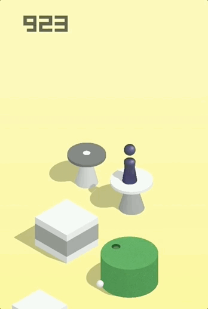

# 教你用 Python 来玩微信跳一跳
[](https://github.com/wangshub/wechat_jump_game/stargazers) [](https://github.com/wangshub/wechat_jump_game/network) [](https://github.com/wangshub/wechat_jump_game/blob/master/LICENSE)

[](https://waffle.io/wangshub/wechat_jump_game/metrics/throughput) 

## 游戏模式

> 2017 年 12 月 28 日下午，微信发布了 6.6.1 版本，加入了「小游戏」功能，并提供了官方 DEMO「跳一跳」。这是一个 2.5D 插画风格的益智游戏，玩家可以通过按压屏幕时间的长短来控制这个「小人」跳跃的距离。分数越高，那么在好友排行榜更加靠前。通过 Python 脚本自动运行，让你轻松霸榜。



可能刚开始上手的时候，因为时间距离之间的关系把握不恰当，只能跳出几个就掉到了台子下面。**如果能利用图像识别精确测量出起始和目标点之间测距离，就可以估计按压的时间来精确跳跃。**

## 原理说明

1. 将手机点击到《跳一跳》小程序界面

2. 用 ADB 工具获取当前手机截图，并用 ADB 将截图 pull 上来
```shell
adb shell screencap -p /sdcard/autojump.png
adb pull /sdcard/autojump.png .
```

3. 计算按压时间
  * 手动版：用 Matplotlib 显示截图，用鼠标先点击起始点位置，然后点击目标位置，计算像素距离；
  * 自动版：靠棋子的颜色来识别棋子，靠底色和方块的色差来识别棋盘；

4. 用 ADB 工具点击屏幕蓄力一跳
```shell
adb shell input swipe x y x y time(ms)
```


## 使用教程

相关软件工具安装和使用步骤请参考 [Android 和 iOS 操作步骤](https://github.com/wangshub/wechat_jump_game/wiki/Android-%E5%92%8C-iOS-%E6%93%8D%E4%BD%9C%E6%AD%A5%E9%AA%A4)

#### 获取源码

```
- git clone https://github.com/wangshub/wechat_jump_game.git

```
##### 非常推荐使用Python3，避免编码及import问题
## PR 要求
##### 请选择 merge 进 master 分支，并且标题写上简短描述，例子 
[优化] 使用PEP8优化代码

## 版本说明

- prod 分支：稳定版本，已通过测试
- master 分支：开发版本，包含一些较稳定的新功能，累计多个功能并测试通过后合并至 prod 分支
- 其他分支：功能开发 (feature) 或问题修复 (bugfix)，属于最新尝鲜版本，可能处于开发中的状态，基本完成后合并至 master 分支

## FAQ

- 详见 [Wiki-FAQ](https://github.com/wangshub/wechat_jump_game/wiki/FAQ)

## 更新日志

- 详见 [changelog](https://github.com/wangshub/wechat_jump_game/blob/master/changelog.md)

## 开发者列表

- 详见 [contributors](https://github.com/wangshub/wechat_jump_game/graphs/contributors)

## QQ 交流

- 314659953 (1000 人)
- 176740763 (500 人)
- 89213434 (2000 人)
- 64389940 (2000 人)
- 169273380 (2000 人)
